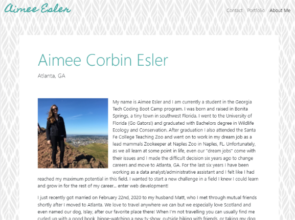
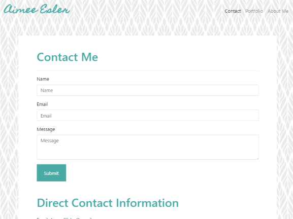
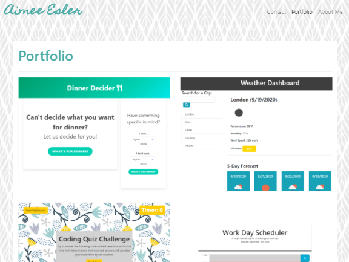
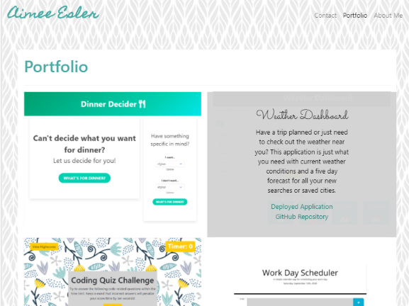

# My Portfolio
This repository contains my portfolio site, including About Me, Contact and Portfolio pages. Repository utilizes HTML, CSS, Javascript and jQuery.

-----

## Table of Contents
* [Installation](#installation)
* [Usage](#Usage)
* [My Portfolio](#my-portfolio)
* [ADA Compliance](#ada-compliance)
* [HTML Validation](#html-validation)
* [Minimum Requirements](#minimum-requirements)
* [Credits](#credits)
* [Links](#Links)
* [License](#license)

-----

## Installation
1. Follow the GitHub Repository Link in the [Links](#Links) section below.
1. Clone the repository using an SSH key.
1. Open GitBash and use "git clone" to clone the repository.

-----

## Usage
Edit using VSCode after [installation](#installation). HTML and CSS files are provided.

-----

## My Portfolio

-----

## ADA Compliance
This webpage was run through the [WAVE Web Accessibility Evaluation Tool](https://wave.webaim.org/) to ensure compliance.

-----

## HTML Validation
Each page of this webpage was run through the [W3C Markup Validation Service](https://validator.w3.org/) to ensure valid and correct HTML. There were no errors or issues found.

-----

## Resources

* [Bootstrap](https://getbootstrap.com/)
* [w3schools](https://www.w3schools.com)
* [jQuery]()

-----

## Links
[Repository Link](https://github.com/aimeecesler/portfolio-v2)

[Deployed Application](https://aimeecesler.github.io/portfolio-v2/)

-----

## License
Copyright &copy; [2020] [Aimee Corbin Esler]

Permission is hereby granted, free of charge, to any person obtaining a copy
of this software and associated documentation files (the "Software"), to deal
in the Software without restriction, including without limitation the rights
to use, copy, modify, merge, publish, distribute, sublicense, and/or sell
copies of the Software, and to permit persons to whom the Software is
furnished to do so, subject to the following conditions:

The above copyright notice and this permission notice shall be included in all
copies or substantial portions of the Software.

THE SOFTWARE IS PROVIDED "AS IS", WITHOUT WARRANTY OF ANY KIND, EXPRESS OR
IMPLIED, INCLUDING BUT NOT LIMITED TO THE WARRANTIES OF MERCHANTABILITY,
FITNESS FOR A PARTICULAR PURPOSE AND NONINFRINGEMENT. IN NO EVENT SHALL THE
AUTHORS OR COPYRIGHT HOLDERS BE LIABLE FOR ANY CLAIM, DAMAGES OR OTHER
LIABILITY, WHETHER IN AN ACTION OF CONTRACT, TORT OR OTHERWISE, ARISING FROM,
OUT OF OR IN CONNECTION WITH THE SOFTWARE OR THE USE OR OTHER DEALINGS IN THE
SOFTWARE.